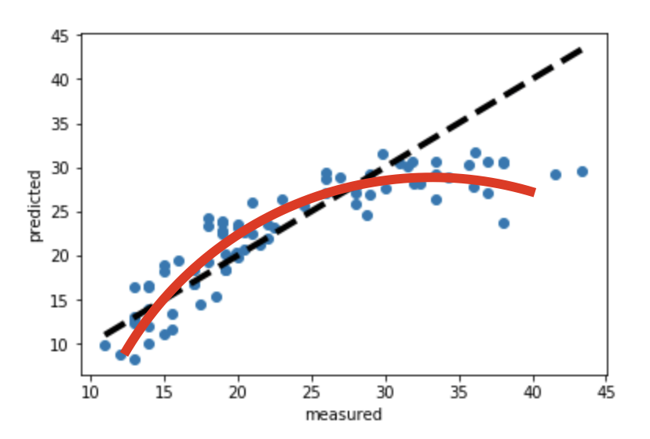

### **CS229 - Lecture 1**

#### Introduction
- AI is the new electricity in that it will make big transformations in all industries
- the demand for ML skills is very high; it will be a long time before we run out of demand for ML experts; the goal of CS229 is to make one an expert in ML

#### Other courses
- CS230 - deep learning (not much overlap); more math in CS229
- CS229A - less math, more applied learning

#### Organization
- AI > ML > DL; to round expertise in this area you need RL, stats, and probability skills

#### Quick overview of the major areas in ML and a preview of the class
- ML definition
  - Arthur Samuel (1959) ML is the field of study that gives computers the ability to learn without being explicitly programmed. He built a checkers playing program through self-play and learned patterns of success.
    - narrow tasks are good targets for AI supplementation of human intelligence
  - Tom Mitchell (1998) a well-poised learning problem: a computer program is said to *learn* from experiment E wtih some task T and some proficiency measure, P. If its performance on T, as measured by P, improves with experiment, E.

- Many tools within ML
  - supervised learning - most used tool in ML
    - example: database of housing prices; given dataset (x,y) and learn a mapping from x -> y. "Regression problem." One can choose models that fit their data (linear, non-linear, etc.)
    
    - classification problem; ex: are breast cancer tumors benign or malignant? There are discrete numbers of values
