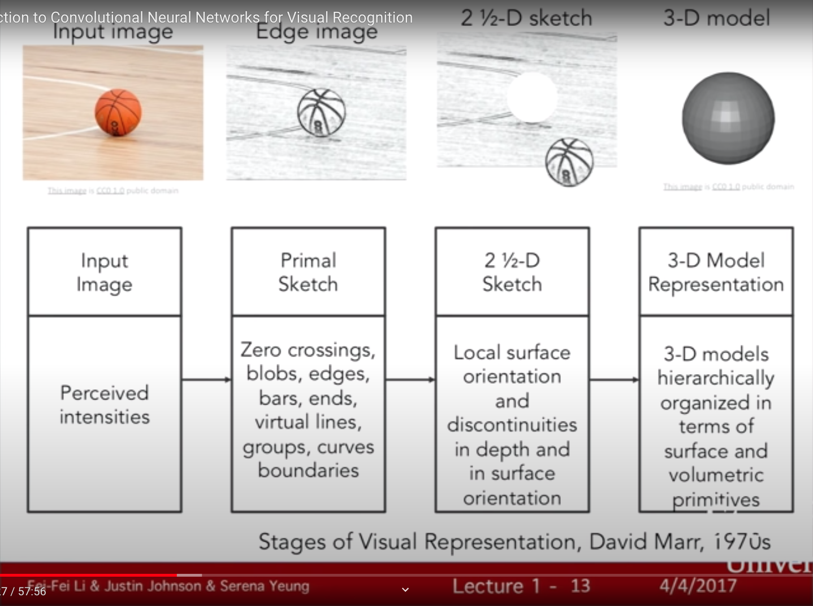
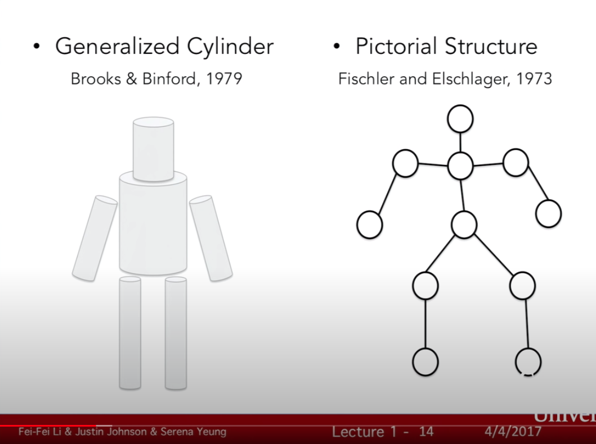

### **CS231n - Lecture 1**: Introduction to convolutional neural networks for visual recognition

#### Introduction
Lots of sensors = lots of data
~80% of data on the web is visual. 5h of new content is added to YouTube every second
Computer vision is at the center of many different fields of science
Related Stanford courses are on slide 1-5

**Brief history of computer vision**:
- ~540 M years ago: # of animal species explode due to evolution's big bang. Andrew Parker - this is due to the onset of *eyes*. From there, life exploded into an evolutionary arms race.

- what about mechanical vision? i.e., cameras.
  - camera obscura, 1545
  - cameras are a super popular sensor today
  - Hubel and Weisel, 1959: mammalian visual processing
    - electrodes in primary visual cortex of cat brains
    - concluded that there are many types of cells: simple cells orient object *edges*
- computer vision
  - Block world, Larry Roberts, 1963
  - 1966: MIT "Summer Vision Project" - AI group; vision is of course a problem that is still not solved > 50 years later.
  - David Marr - vision book;
  

    a) Generalized cylinder (Brooks, Binford, 1979)
    b) Pictorial structure (Fischler, Elschlager, 1973) 
  - Face detection
  - SIFT feature recognition, object recognition (D. Lowe, 1999)
  - Spatial pyramid matching - takes features and vector machine algorithms
  - Histogram of gradients (2005), Deformable Part Mode (2009)
  - **One thing is changing**: ***better quality data***
  - Pascal visualization object challenge
    - MAP = mean average precision
    - Image-net.org - 22,000 categories, 14M objects/images
  - When we don't have a lot of data, overfitting happens quite quickly
  - 2012 - AlexNet - convolutional neural net
  - Deep learning
  - 2015 - ResNets;
  - currently: object detection, image captioning, action classification
  - CNNs, NIPS, Krizhevsky; deeper NNs every year
  - 1998: LeCun (Bell Labs) - CNN input for images of digits; structure looks similar to the 2012 AlexNet architecture
  - Why the explosion in AI now?
    - Moore's law, GPUs; 10^9 vs 10^6 transistors = more compute power
    - Data... mechanical turk
  - Computer vision goes far beyond object recognition
  - "Deep Learning" - Goodfellow (free online)
  - **Course Philosophy**:
    - thorough, detailed
    - practical
    - state of the art
