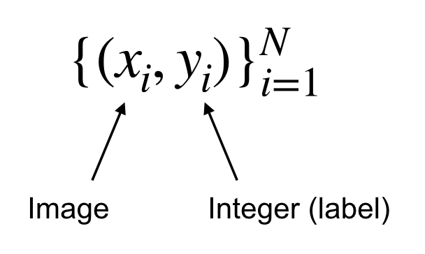
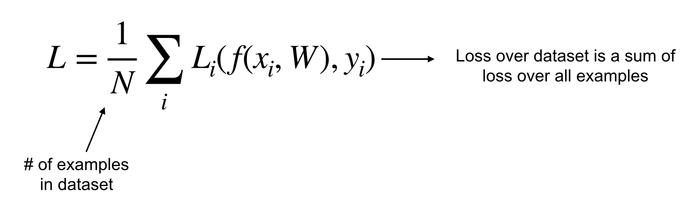
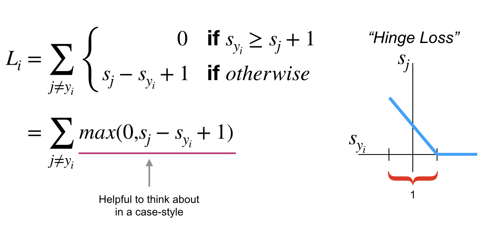
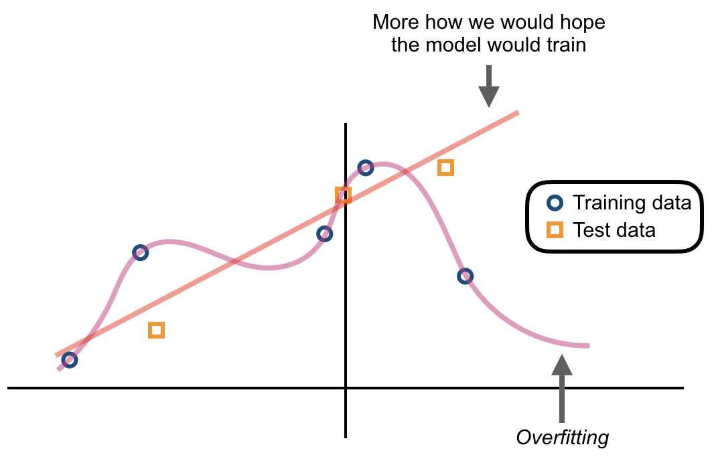
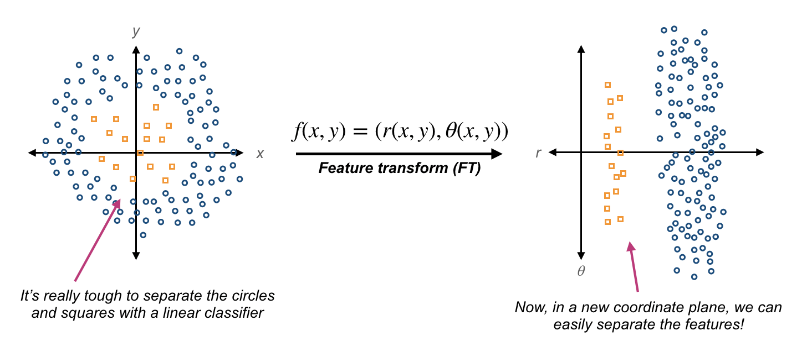
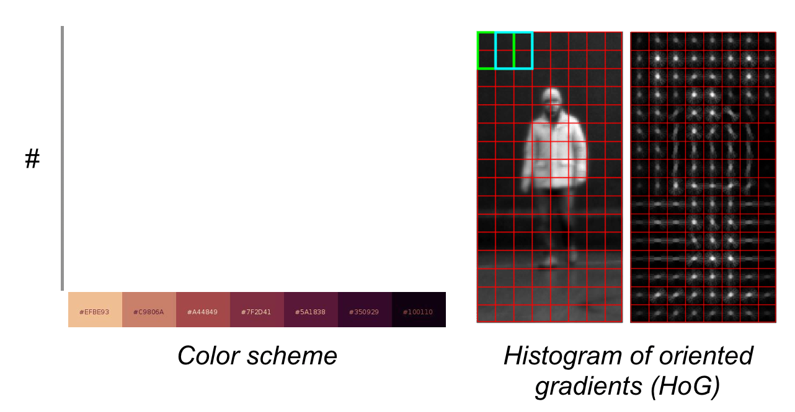

### **CS231n - Lecture 3**: Loss functions and optimization

- starting from lecture 2 with a linear classifier, we need to:
  1. define a loss function to quantify the "goodness" of score across training DataFrame
  2. find an efficient way to optimize parameters that minimize the loss function
  ***A loss function tells us how good our current classifier is***

  *given a dataset of examples:*
  
  

- ***GOAL***: find a $W$ that **minimizes the loss**

#### Multiclass support vector machine (SVM)
  - sum over all categories, $y$ except for the true category, $y_i$. all categories that are not the true label are compared with $y_i$.
  - *scores vector shorthand*: $s = f(x_i,W)$

  

  - *loss goes down linearly until we hit the safety margin, after which, loss = 0.*
  - in your loss function, you might use a square loss to exaggerate the effect compared to a linear loss functions

  - ***vectorized example of Numpy code for multiclass SVM loss***

  - $L(W) = \frac{1}{N} \sum_{i=1}^{N}L_i(f(x_i,W),y_i) + \lambda R (W)$

    ```
    def L_i_vectorized( x, y, W ):
      scores     = W.dot(x)
      margines   = np.maximum(0, scores - scores[y] + 1)
      margins[y] = 0
      loss_i     = np.sum(margins)

      return loss_i
    ```  
    - if $L = 0$, is $W$ unique? ***NO!*** $2*W$ also has $L=0$!
    - we have only told our classifier to calculate $loss$ on the training data; we don't worry about $2W$ or some other $W$.

    

**L2 regularization**

  - There are many types of regularization used in practice
      - L2 (eculidian) regularization is common; $R(W) = \sum_k \sum_l W_{k_i,l}^2$
      - L2 regularization with *weight decay*; $R(W) = \sum_k \sum_l W_{k,l}^2$
          - $x = [1, 1, 1, 1]$
          - $w_1 = [1, 0, 0, 0]$
          - $w_2 = [0.25, 0.25, 0.25, 0.25]$
          - $W_1^T x = W_2^T x = 1$

          - ***for Bayesians***: L2 regularization correlates to MAP inference using a Gaussian prior on $W$

      - *also popular in deep learning: **softmax classifier*** (multinomial logistic regression) where scores are un-normalized log probabilities of the classes

      

      - *each probability is between 0 and 1; it sums across all classes to be equal to 1.*

      - $L_i = -logP(y = y_i | x = x_i)$ and in summary $L_i = -log(\frac{e^s_{y_i}}{\sum_j e^{s_j}})$

      - what are the $min()$ and $max()$ values of softmax loss? 0 and $inf$, $[0,inf)$
      - SVM stops trying to improve a class once you pass an arbitrary margin of goodness, but softmax will always try to keep minimizing.

**Recap**

  - some data (x,Y)
  - score function: $s = f(x, W) = W_x and we have a loss function (SVM or softmax) with a regularization term, $R(W)$ (penalizas model complexity) added to the loss calculation to get the ***full loss***.

  - *Question*: so, how do we find $W$ such that it minimizes loss?
  - *Answer*: optimization, there are two strategies.
    1. **random search** - a ***very bad idea***

    ```
    # assume x_train are the data where each column is an example (e.g., 3073 x 50,000)
    # assume Y_train are the labels (e.g. 1-D array of 50,000)
    # assume the function L evaluates the loss function

    bestloss = float("inf") # python assigns the highest possible float value
    for num in xrange(1000):
      W = np.random.randn(10,3073) * 0.0001 # generate random parameters
      loss = L(x_train, Y_train, W) # get the loss over the entire training set
      if loss < bestloss: # keep track of the best solution
        bestloss = loss
        bestW = W
      print('In attempt %d the loss was %f, best %f' % (num, loss, bestloss))
    ```

    ```
    out:
    in attempt 0 the loss was 9.401632, best 9.401632
    in attempt 1 the loss was 8.912321, best 8.912321
    in attempt 2 the loss was 9.044013, best 8.912321
    in attempt 3 the loss was 9.274324, best 8.912321
    in attempt 4 the loss was 8.851431, best 8.851431
    in attempt 5 the loss was 8.931232, best 8.851431
    in attempt 6 the loss was 8.941213, best 8.851431
    in attempt 0 the loss was 8.602343, best 8.602343
    ... continues for 1000 lines
    ```
    2. follow the slope via load topography - this is generally the most followed strategy.

    ```
    # assume x_train is [3073 x 10000], Y_test [10000 x 1]
    scores = Wbest.dot(Xte_cols) # 10 x 10000, the calss scores for all test examples
    # find the index with max score in each column (the predicted class)
    Yte_predict = np.argmax(scores, axis = 0)
    # calculate accuracy (fraction of predictions that are correct)
    np.mean(Yte_predict == Yte)
    ```

    ```
    out:
    0.1555
    ```

    15% accuracy! SOTA is about 95%

    - what do we mean when we talk about the slope?
      - in 1 dimension, the derivative of a function is: $\frac{df(x)}{dx} = \lim_{h\to0} \frac{f(x+h) - f(x)}{h}$ where $h$ is a small step
        *note*: $x$ is usually an entire vector of input values, not a scalar
      - in multi-dimensional problems, the ***gradient*** = *vector of partial derivatives along each dimension*
      - the slope in any direction is the ***dot product of the direction with the gradient***
      - direction of ***steepest descent*** = *negative gradient*
      - you can iteratively update a parameter vector
      - on a computer, we use the method of ***finite differences***

      | **current $W$**    | **compute**   |**gradient $dW$** |
      |--------------------|---------------|------------------|
      | [0.34,             | 0.34 + 0.0001 | [-2.5,           |
      | -1.11,             | ...           | 0.6,             |
      | 0.12,              |               | 0.0,             |
      | 0.55,              |               | 0.2,             |
      | 2.81,              |               | 0.7,             |
      | -3.10,             |               | -0.5,            |
      | -1.50,             |               | 1.1,             |
      | 0.33,...]          |               | 1.3,             |
      | **loss = 1.25347** |               | -2.1,...]        |

      ***this is a bad idea - too slow!***
    - instead, we can use calculus as *loss is a function of $W$*. to this end, we can obtain the *analytic gradient*: this is **exact** and **fast**
    $L = \frac{1}{N} \sum_{i=1}^{N} L_i + \sum_k W_k^2$
    $L_i = \sum_{j≠y_i}max(0,s_j - s_{y_i} + 1)$
    $s = f(x, W) = W_x$

    - we can compute $dW$ in one step with the analytic gradient
    - **numerical** = **approximation** and **slow**, but easy to write - this means we can use this to spot-check our calculation of the analytical gradient (common practice)

**gradient descent**
  ```
  # vanilla gradient descent

  while True:
    weights_grad = eval_gradient(loss_func, data, weights)
    weights += -(step_size) * weights_grad # perform parameter update
  ```
  - step size = hyperparameters or learning rate; ***it is very important to get this HP set first!)***
  0 there are fancier step optimizations, but they're the same, fundamentally

**stochastic gradient descent**

  - full sum expensive with large $N$:
  $L(W) = \frac{1}{N} \sum_{i=1}^{N} L_i(x_i,y_i,W) + \lambda R(W)$
  - add in the approximate sum using a minibatch ($\nabla_w$ of examples at every iteration: 32/64/18 are common)
  $\nabla_w L(W) = \frac{1}{N} \sum_{i=1}^{N} \nabla_w L_i(x_i,y_i,W) + \lambda \nabla_w R(W)

  ```
  # vanilla minibatch gradient descent

  while True:
    data_batch = sample_training_data(data, 256) # samples 256 examples
    weights_grad = evaluate_gradient(loss_func, data_batch, weights)
    weights += - (step_size) * weights_grad # perform parameter update
  ```
  *note: monte carlo estimation is related - look into this later*

**Aside**: image features
  - raw pixel values -> deep NNs are not usually great for these tasks
  - rather than the raw values, ***feature representations*** are fed into a classifier

  **Motivation for image features**:
  

  - what is the right feature transformation for a given problem / input data?

  

  - pictures: **color histogram** (above, left)

  - pictures: **histogram of oriented gradients** (HoG) (above, right)

      - divide an image into 8x8 pixel regions

      - quantize edge into 9 bins in each region; collect the **edge info**

  - bag of words: occurance of words in a paragraph (NLP)
    1. extract random patches of images
    2. cluster patches to construct a "cookbook" of "visual words"
    3. encode images

- image features vs. ConvNets
  - only difference is that in ConvNets, we learn features directly from the data.
