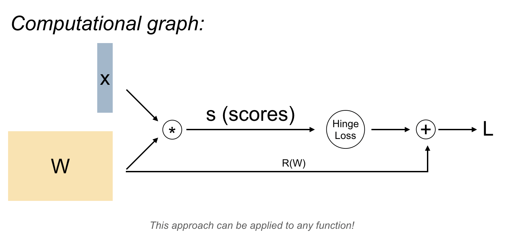

### **CS231n - Lecture 4**: Intro to neural networks and back-propagation
---
*where we are so far*:
  - scores function: $s = f(x, W) = W_x$
  - SVM loss: $L_i = \sum_{j ≠ y_i} max (0, s_j - s_{y_i} + 1)$
  - Data loss and regularization: $L = \frac{1}{N} \sum_{i=1}^N L_i + \sum_k \sum_{k}^2$

  **what we want**: $\nabla_w L$ *to minimize the loss function via optimization by gradient descent*

  **gradient descent**: $\frac{df(x)}{dx} = \lim_{h\to0} \frac{f(x+h) - f(x)}{h}$
    - numerical gradient: slow, approximation, easy to write
    - analytical gradient: fast, exact, ***but*** *error-prone*
    - *So*: derive the analytical gradient, check the code with the numerical gradient

**Today**: compute the analytical gradient for arbitrarily complex functions using computational graphs framework

$f = W_x$ ; $L_i = \sum_{j≠y_i}max(0,s_j - s_{y_i} + 1)$

Now we can use back-propagation!
---
