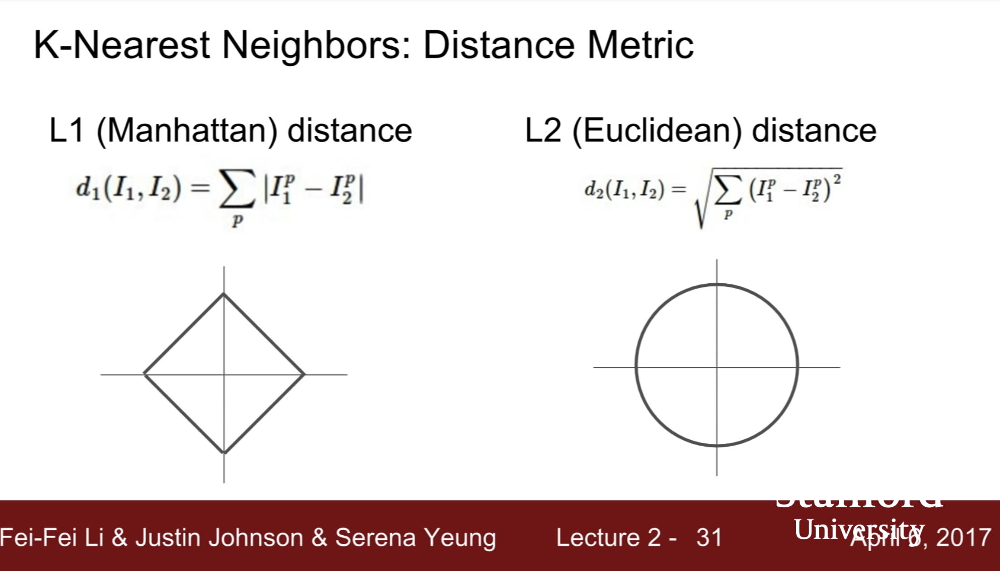

### **CS231n - Lecture 2**: Image classification

- **assignment 1**: kNN, linear classifiers, SVM, softmax, 2-layer NN, image features

- discrete set of category labels - pick one to label a picture
- picture of a cat vs what the computer sees, an 800px x 600px x 3 channels (RGB) matrix: 
- we need robustness!

1. kNN: k nearest neighbors
    - step 1: memorize all the data
    - step 2: predict the label most similar to the training labels
  - to compare images: **distance metric**
    - **L1 (Manhattan) distance**: $d_1(I_1,I_2) =\displaystyle\sum_{\rho}^{}|I_{1}^\rho-I_2^\rho|$; add up the pixel-wise absolute value of the distances to compare images.
      - kNN requires a lot of compute - *each* test because you do not really train anything and you evaluate against *all* images for each test - this is the opposite of a convolutional neural net
      - instead of copy a label from the nearest neighbors, take the majority vote from the *k* closest points. There are fancier options, but this is simple and effective.
    - **L2 distance (eculidian distance)**: $d_2(I_1,I_2) =\sqrt{\displaystyle\sum_{\rho}^{}(I_{1}^\rho-I_2^\rho)^2}$
    - Interestingly, each distance metric makes different assumptions; L1 space is distributed in a square whereas L2 distance is a circle. L1 distance changes when you rotate the coordinate frame whereas L2 does not change. If the input vector has some important meaning, perhaps L1 is more natural; if not, L2 may be a more natural choice; pick what makes sense for your application. 
  - kNN is a good choice when looking at a new problem because it is very smiple, yet generalizes to many types of data.
  - choice of *k* and the *distance metric* are **hyperparameters**. How do we make a choice for our data? This turns out to be very problem-dependent; you must try them all out and see what works best.

#### Setting hyperparameters (HPs)
  - **idea #1**: choose HPs that work best - ***this is a bad idea!***
    - k=1; this is what we would ***always*** choose! It works perfectly on training data (overfitting).
  - **idea #2**: splot the data into test and train; choose HPs that work best on the test data.
    - this is ***also a bad idea!*** this approach offers no information on how the algorithm will perform on new data because the **test set is not representative of new, unseen data**.
  - **idea #3**: split the data into training, validation, and test groups. Choose HPs based on the performance **on validation data and evaluate that performance on the test data**. This evaluation is the number you report! Typically, people make their best effort not to touch their test data until they need to use it, so as not to bias their tuning of the HPs.
    - ****:
  - **idea #4**: cross-validation (x-val). split the data info ***folds***, try each fold as validation and average the results.
    - ***GOLD STANDARD***... but, in practice, this is used for small datasets, not so much in deep learning or where computational training is expensive.
    - how representative might a training set be? **Answer**: *we make the assumption*: data are independently and identically distributed.
    - make plots to show the accuracy of performance as a function of the chosen HPs
  - kNN is almost ***never used*** on images because:
      1. slow at test time
      2. distance metrics on pixels are ***NOT INFORMATIVE***
  - ***curse of dimensionality***: you will never have enough images to train all pixel spaces using kNN because as points ($n$) grow in dimensionality, $n^{Dim}$, the pixel space explodes.

#### kNN Summary
  - In image classification, we start with a training set of images and labels and predict labels on a test set.
  - kNN classifier predicts labels based on nearest training examples
  - Distance metrics ($L1, L2$) and $k$ = hyperparameters.
  - Choose HPs using the validation set. Run on the test set ***only once at the very end***.

#### Linear classification
  - simple learning algorithm but super important and will help us build whole NNs as well as whole convolutional NNs
  - NNs are often thought of as constructions of building blocks where each block is something simple; often these blocks are linear classifiers.
  - ***Deep*** NNs are like building blocks that can be designed and combined to perform non-trivial tasks.

  - CIFAR-10: each image is 32px x 32px x 3-color channels.
  

    

***Coming up:***
    - **loss functions** - quantify what it means to have a good $W$
    - **optimization** - start with random $W$ and find $W$ such that loss is *minimized*
    - **ConvNets** - tweak functional form of $f$
